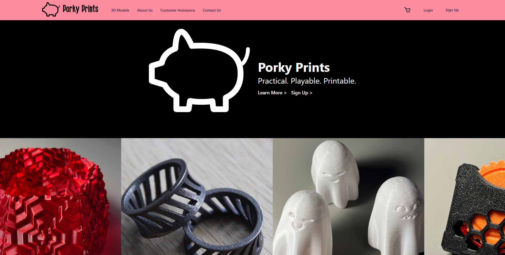

# PorkyPrints-Frontend


An Ecommerce Website for personalized 3D printed models, with full user customization via a 3D configurator, and integrated Stripe payments.


## Features

- Live renders of user-customized models via [react-three-fibre](https://github.com/pmndrs/react-three-fiber)

- Order placement and checkout via Stripe
- Order status tracking on user's own Profile page

## Setup

This project is the frontend repository of PorkyPrints. It is to be run with [PorkyPrints-Backend](https://github.com/Nyx92/3D-Model-Ecommerce-Backend).
This repo is created using create-react-app. Before starting, make sure to perform these steps:

1. Configure.env file

- it should contain stripe public key, backend url (defaulted to port 3004)
- all other env variables will need to be prepended with `REACT_APP` so that it can work (restarting the server is required)

```
REACT_APP_BACKEND_URL="http://localhost:3004"
REACT_APP_STRIPE_PK=<stripe_public_key>
```

2. Install packages and Run Locally

```
npm i
npm start
```

3. [Optional] Login with default seed user
   To view or play around with payments flow and order history, either create a new user or use one of our seed user data and login with the following details:
   - user: john@gmail.com
   - pw: password

## Directory Tree

- /public: all images resources
- App.jsx: all routes
- /components: all fe components in individual directories
- /pages: all navigational pages on the app
